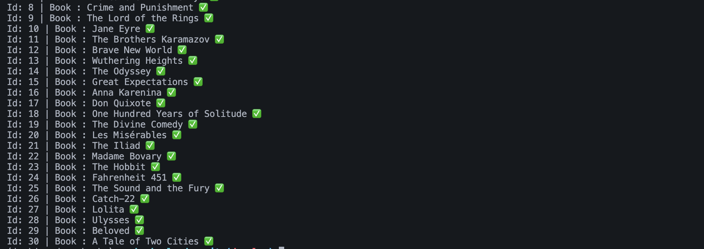
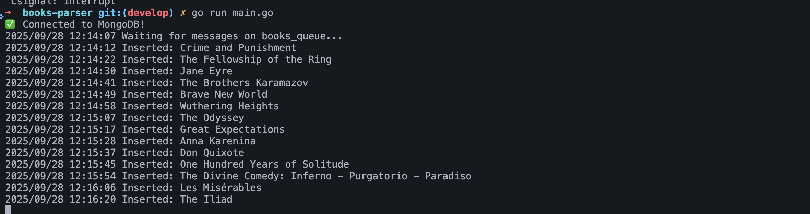
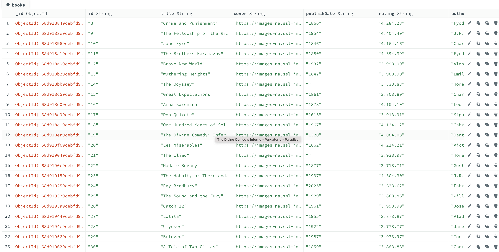
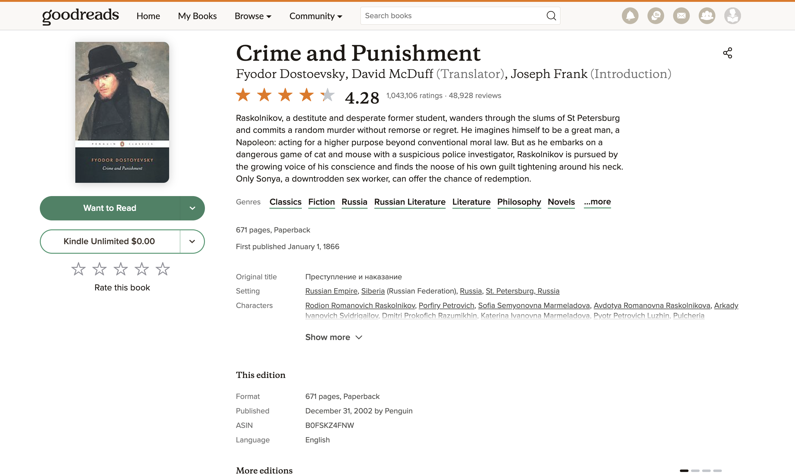
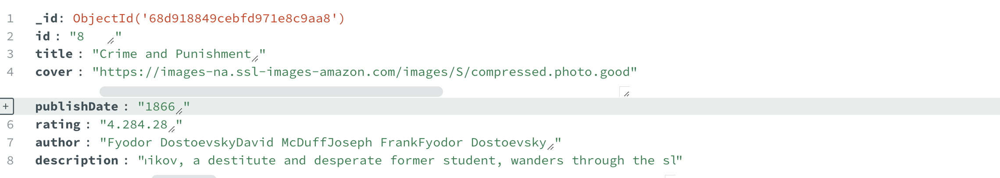
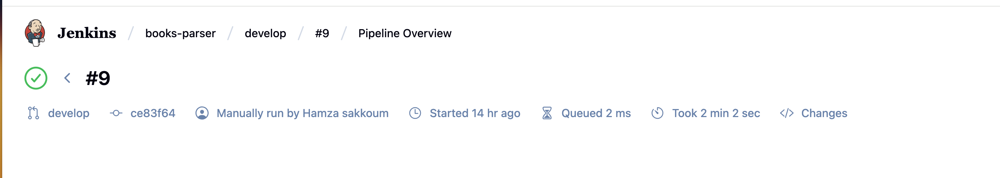
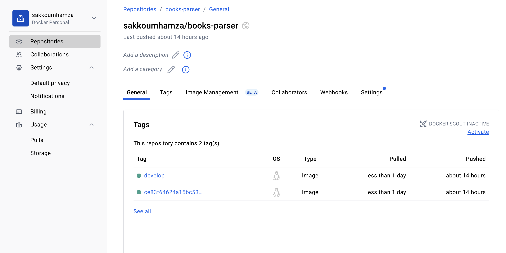

# 📚 Book Parser Microservice

**Book Parser** is a microservice that extracts book data from a RabbitMQ queue, performs web scraping on Goodreads.com to extract the book's data, and stores it in MongoDB. It is fully containerized using Docker and Docker Compose, with automated CI/CD and security checks.  

This microservice is designed for scalable, automated book data ingestion and processing in modern microservices architectures.

---

### Key Features
- Reads book data from a **RabbitMQ queue**  
- Performs web scraping on **Goodreads.com** to enrich book data  
- Stores data in **MongoDB**  
- Fully containerized using **Docker** and orchestrated with **Docker Compose**  
- Security tested via **Nancy**  
- Code quality enforced with **Go lint**  
- Automated CI/CD pipeline with **Jenkins** and DockerHub  
---

## 👨🏻‍💻 Project Structure

```text
.
├── cmd/                  # Main service entry points
├── internal/             # Internal packages
├── scripts/              # Scripts for linting and security tests
├── docker-compose.yml    # Docker Compose for RabbitMQ & MongoDB
├── Dockerfile
├── Jenkinsfile
├── README.md
├── screenshots/
└── reports/              # CI/CD reports
```

---
## 🧑🏽‍💻 Pre-requisites

- Go >= 1.20
- MongoDB server (or via Docker Compose)
- RabbitMQ server (or via Docker Compose)
- Docker & DockerHub account
- Jenkins for CI/CD pipeline with Docker Hub credentials set 

---

## CI/CD (Jenkins + DockerHub)

1. Pulls the repository

2. Runs Go lint and Nancy security tests

3. Builds the Docker image

4. Pushes the Docker image to DockerHub (preparing it for deployment)

## 📸 Screenshots

### 🔹 Books queue 


### 🔹 Parsing from GoodReads (Web scrapping)


### 🔹 Mongodb storage 


### 🔹 GoodReads book : Crime And Punishment


### 🔹 Crime And Punishment scraped


### 🔹 Jenkins


### 🔹 Docker Hub image repository


## Installation
**Clone the repository:**
```bash
git clone https://github.com/sakkoumhamza/books-parser-microservice.git
cd books-parser-microservice
```
**Set up Docker Compose (MongoDB + RabbitMQ)**
```bash 
docker-compose up -d

```
**Build the Go service**
```bash
go build -o book-parser ./cmd
```
**Running the service:**
```bash 
./book-parser
```
---
## 🐳 Docker Setup

**Build the image**

```bash
docker build -t yourdockerhubusername/books-parser:latest .
```

 **Run the container**

```bash
docker run yourdockerhubusername/books-parser:latest
```

## 🫂 Contributing
``` text
1. Fork the repository

2. Create a feature branch (git checkout -b feature/new-feature)

3. Commit your changes (git commit -m 'Add new feature')

4. Push to your branch (git push origin feature/new-feature)

5. Open a Pull Request
```
 